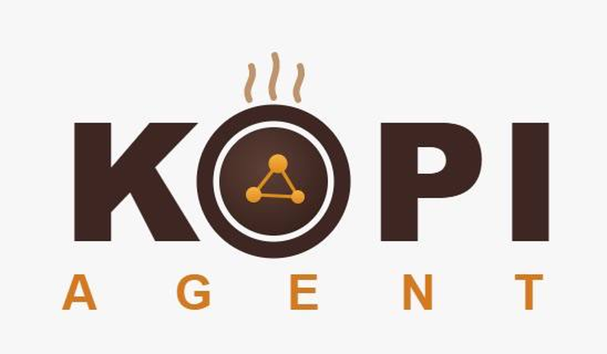

<p align="center">
  
</p>

# KOPI AI AGENT ☕
Kopi Ai Agent Pte Ltd (سنگاپور) کی جانب سے

<p align="center">
  <a href="https://kopiaiagent.com"><b>kopiaiagent.com</b></a> · <a href="https://github.com/LINYIQ66/kopi-ai-agent">GitHub</a>
</p>

<p align="center">
  <a href="https://kopiaiagent.com/docs/"></a>
  <a href="https://github.com/LINYIQ66/kopi-ai-agent/blob/main/LICENSE"></a>
  <a href="README.zh-CN.md"></a>
  <a href="README.md"></a>
  <a href="README.es.md"></a>
</p>

**خود کو بہتر بنانے والا AI ایجنٹ۔** تجربے سے مہارتیں تخلیق کرتا ہے، استعمال کے دوران انہیں بہتر کرتا ہے، سیشنز کے درمیان علم کو محفوظ رکھتا ہے، اور آپ کی ایک گہری ماڈل تیار کرتا ہے۔ اسے $5 VPS، GPU کلسٹر، یا کلاؤڈ پر چلائیں۔ Telegram سے بات کریں جب یہ کلاؤڈ VM پر کام کر رہا ہو۔

نیا انسٹال خودکار طور پر **5 ملین ٹوکنز** کے ساتھ آتا ہے۔

---

## فوری انسٹال

### Linux، macOS، WSL2، Termux

```bash
curl -fsSL https://kopiaiagent.com/install.sh | bash
```

### Windows (PowerShell)

```powershell
iex (irm https://kopiaiagent.com/install.ps1)
```

---

## دستاویزات

📖 **[kopiaiagent.com/docs](https://kopiaiagent.com/docs/)**

---

## لائسنس

MIT — دیکھیں [LICENSE](LICENSE)۔

[Kopi Ai Agent Pte Ltd (سنگاپور)](https://kopiaiagent.com) کی طرف سے تیار کردہ۔
